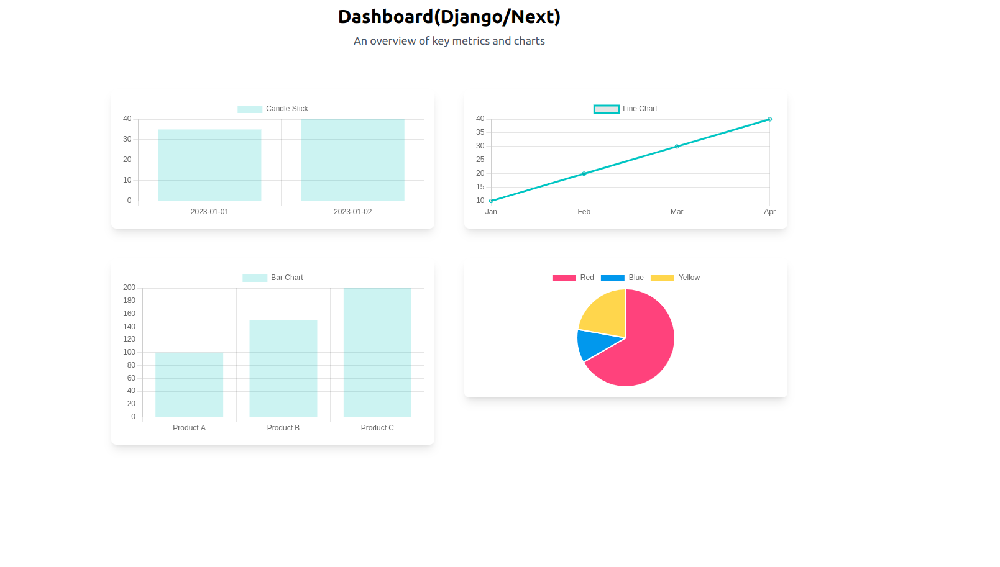

# Dashboard(Django/Next)

A web application built with Next.js on the frontend and integrated with a Django API backend. The application features a dashboard page displaying multiple charts: Candlestick, Line Chart, Bar Chart, and Pie Chart. The data for these charts is retrieved from the backend.

 # Objective

Build a web application using Next.js for the frontend and integrate it with a Django API backend. The application will feature a basic dashboard page with multiple charts, and the data will be retrieved from the backend.

# Features

- Displays a dashboard with four types of charts: Candlestick, Line, Bar, and Pie.
- Fetches data from a Django API backend.
- Utilizes a popular charting library (e.g., Chart.js) to render the charts.
- Handles errors gracefully when fetching data from the API.
- Responsive design for optimal viewing on different screen sizes.

# Technologies Used

- **Frontend:** Next.js, React, Axios (for API calls)
- **Backend:** Django, Django REST Framework (optional)
- **Charting Library:** Chart.js or similar
- **Testing:** Jest, React Testing Library
- **Optional:** TypeScript, Docker

# Installation

**Prerequisites**

- Node.js
- Python
- pip
- virtualenv (optional)

# Backend Setup

1. Clone the repository:
    ```bash
    git clone git@github.com:preston-56/django-next.git
    ```

2. Navigate to the backend directory:
    ```bash
    cd backend
    ```

3. Create a virtual environment (optional):
    
    ```bash
    virtualenv env
    source env/bin/activate
    ```

4. Install the required packages:
    
    ```bash
    pip install -r requirements.txt
    ```

5. Apply database migrations:
    
    ```bash
    python3 manage.py migrate
    ```

6.  Start the Django development server:
 
    ```bash
    python3 manage.py runserver
    ```

# Frontend Setup

1. Navigate to the frontend directory:

    ```bash
    cd frontend
    ```

2. Install the required packages:

    ```bash
    npm install

    ```
3. Start the Next.js development server:

    ```bash
    npm run dev
    ```

# Usage

***Running the Application***

1. Start the Django backend server:

    ```bash
    cd backend
    python manage.py runserver
    ```

2. Start the Next.js frontend server:
 
    ```bash
    cd frontend
    npm run dev
    ```

# Accessing the Dashboard

- Open your web browser and navigate to [http://localhost:3000](http://localhost:3000). You should see the dashboard with the four charts.

# API Endpoints

- The Django backend provides the following API endpoints:

- `/api/candlestick-data/`: Returns JSON data for the Candlestick chart.
- `/api/line-chart-data/`: Returns JSON data for the Line chart.
- `/api/bar-chart-data/`: Returns JSON data for the Bar chart.
- `/api/pie-chart-data/`: Returns JSON data for the Pie chart.

### Data Structures

# Candlestick Data

```json
{
  "data": [
    {
      "x": "2023-01-01",
      "open": 30,
      "high": 40,
      "low": 25,
      "close": 35
    },
    {
      "x": "2023-01-02",
      "open": 35,
      "high": 45,
      "low": 30,
      "close": 40
    }
  ]
}

```


# Line Chart Data

```json

{
  "labels": ["Jan", "Feb", "Mar", "Apr"],
  "data": [10, 20, 30, 40]
}
```

# Bar Chart Data

```json

{
  "labels": ["Product A", "Product B", "Product C"],
  "data": [100, 150, 200]
}
```

# Pie Chart Data

```json

{
  "labels": ["Red", "Blue", "Yellow"],
  "data": [300, 50, 100]
}
```

# Testing
Unit Tests

To run the unit tests for the Django API:

```bash
cd backend
python3 manage.py test
```

# Integration Tests
- To run the integration tests for the Next.js frontend:

```bash
cd frontend
npm test
```

# Deployment
Docker
- To deploy the application using Docker:

Install Docker on your system.

Build the Docker images for the backend and frontend:

```bash
docker build -t backend .
docker build -t frontend .
```

Run the Docker containers:

 **To run the backend:**

```bash
docker run -p 8000:8000 backend
```

 **To run the frontend:**

```bash
docker run -p 3000:3000 frontend
```

- The application should now be accessible at [http://localhost:3000](http://localhost:3000).
  
  **Django/Next Dashboard**
  

# Contributing
- If you would like to contribute to this project, please follow these steps:
- Fork the repository.
- Create a new branch for your feature or bug fix.
- Make your changes and commit them.
- Push your changes to your forked repository.
- Submit a pull request to the original repository.
  
# License
- This project is licensed under the[ MIT License](./LICENSE).